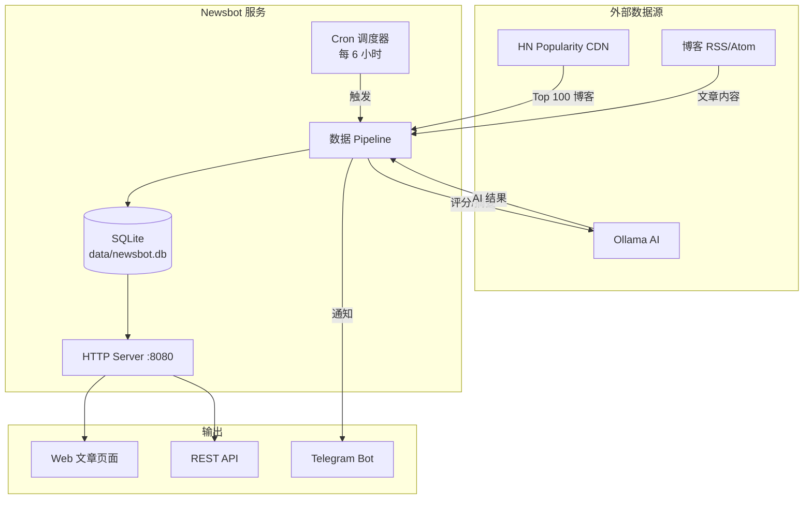
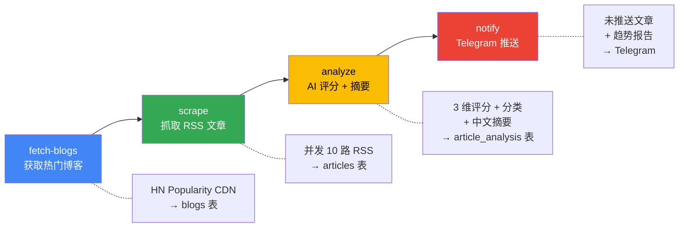
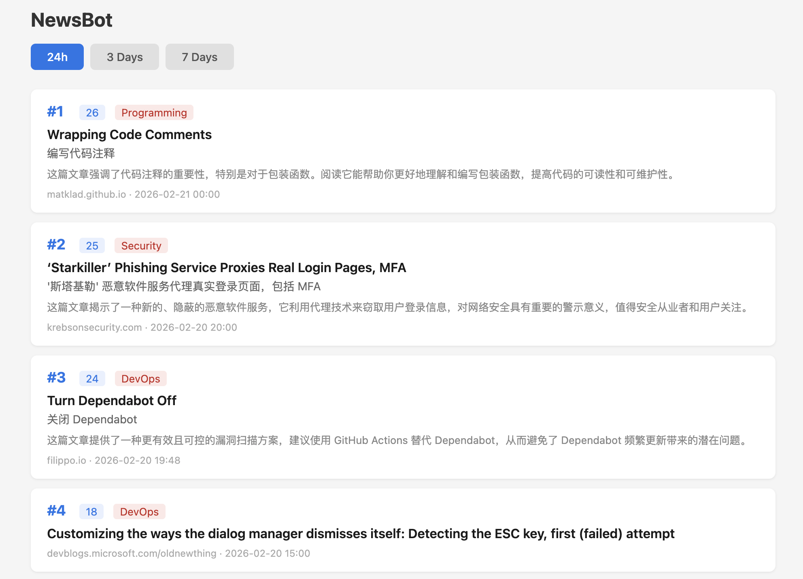
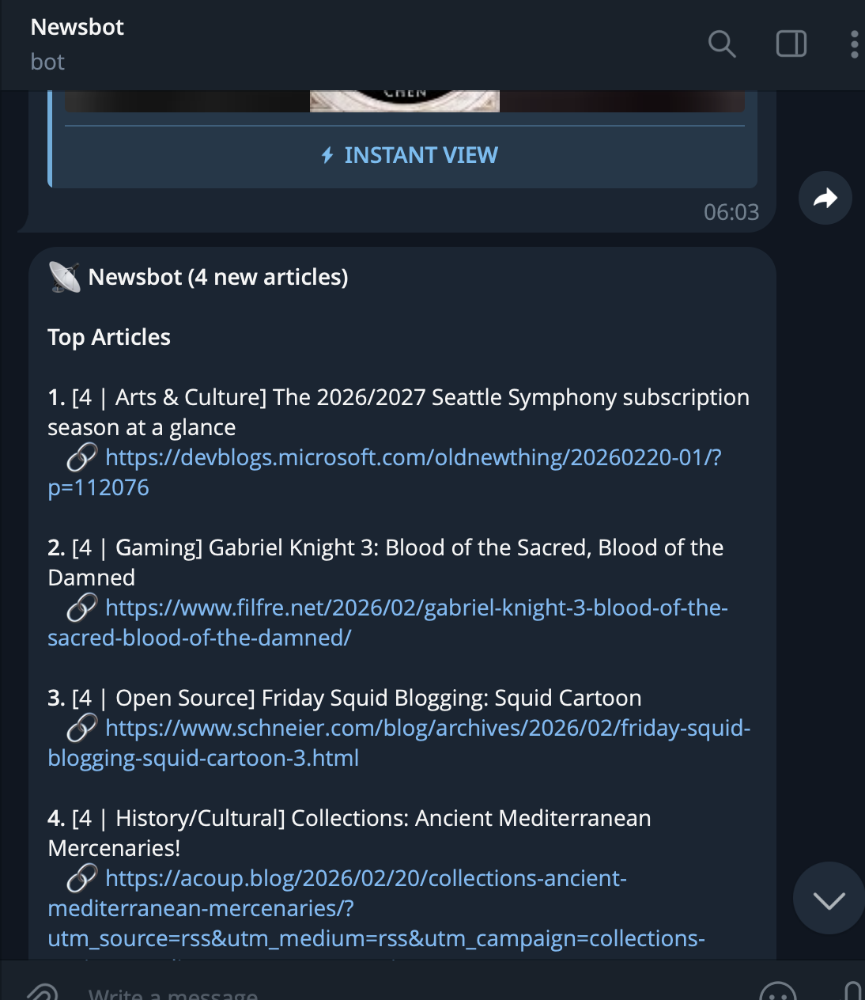
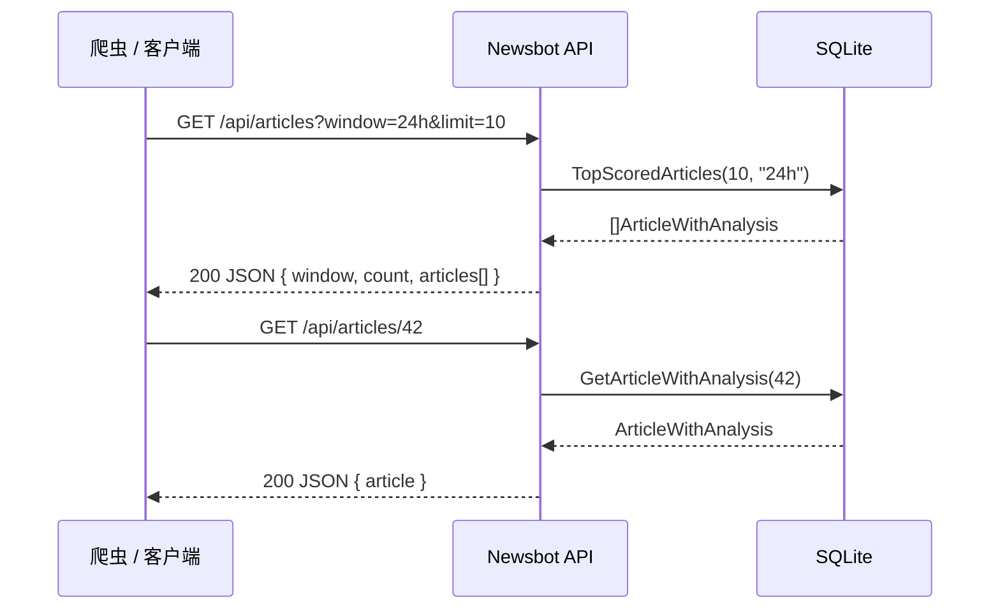

# Newsbot

Newsbot 是一个自动化技术新闻聚合与分析工具。它从 Hacker News 热门博客中抓取最新文章，利用 AI（Ollama）进行评分、分类、摘要和趋势分析，并通过 Telegram Bot 推送每日技术速报。内置 HTTP 服务提供文章浏览页面和 REST API。

## 系统架构



## 数据 Pipeline



1. **fetch-blogs** — 从 [HN Popularity](https://refactoringenglish.com/tools/hn-popularity/) CDN 获取 Top 100 热门博客
2. **scrape** — 并发抓取博客 RSS/Atom 订阅源（10 路并发，兼容 RSS 2.0 / Atom），每个博客最多 10 篇文章
3. **analyze** — AI 从相关性、质量、时效性三个维度打分（1-10），自动分类和关键词提取；为所有文章生成结构化摘要、中文标题翻译、推荐理由（失败自动重试 3 次）
4. **report** — 输出 Top 文章列表 + AI 归纳 2-3 个宏观技术趋势，自动推送 Telegram（如已配置）
5. **notify** — 自动筛选未推送的文章，生成趋势报告并发送 Telegram 通知

## 效果展示

### 文章浏览页面

> 访问 `http://localhost:8080/articles`，支持 24h / 3 Days / 7 Days 时间窗口切换



### Telegram 推送

> 配置 Bot Token 和 Chat ID 后，pipeline 完成自动推送技术速报



## 快速开始

### 前置条件

- Go 1.24+
- Ollama 实例（或兼容 OpenAI API 的服务）
- （可选）Telegram Bot Token

### 安装

```sh
git clone https://github.com/chyiyaqing/newsbot.git
cd newsbot
make build
```

### 配置

创建 `newsbot.yaml`：

```yaml
ollama:
  address: "https://your-ollama-server.com"
  model: "gemma3:4b"
```

创建 `.env` 文件存放敏感信息：

```
OLLAMA_USERNAME=your_username
OLLAMA_PASSWORD=your_password
TG_BOT_TOKEN=123456:ABC-DEF...
TG_CHAT_ID=-100123456789
```

环境变量（覆盖 YAML）：

| 变量 | 说明 |
|---|---|
| `OLLAMA_ADDRESS` | Ollama API 地址 |
| `OLLAMA_MODEL` | 模型名称（默认 `gemma3:4b`） |
| `OLLAMA_USERNAME` | Basic Auth 用户名 |
| `OLLAMA_PASSWORD` | Basic Auth 密码 |
| `TG_BOT_TOKEN` | Telegram Bot API Token |
| `TG_CHAT_ID` | Telegram 聊天/频道 ID |

`.env` 文件在启动时自动加载。

### 使用

```sh
# 单步执行
go run . fetch-blogs            # 获取热门博客
go run . scrape                 # 抓取最新文章
go run . analyze 24h            # AI 分析（可选 3days / 7days）
go run . report 24h             # 生成报告 + 自动推送 Telegram
go run . notify 24h             # 自动推送未通知的文章到 Telegram

# 后台服务（推荐）— 立即执行 pipeline，然后 HTTP + cron 每 6 小时一次
go run . run
go run . run "0 */2 * * *"      # 自定义 cron 表达式
go run . run --addr=:9090       # 自定义 HTTP 监听地址
```

### Docker 部署

```sh
# docker compose（推荐）
make up                         # 构建并启动
make down                       # 停止

# 或手动
make docker                     # 构建镜像
make docker-run                 # 运行容器
```

## HTTP Server & REST API

`run` 命令启动 HTTP 服务（默认 `:8080`）和 cron 调度器。

### 页面

| 路径 | 说明 |
|---|---|
| `GET /` | 重定向到 `/articles?window=24h` |
| `GET /health` | 健康检查 — `{"status":"ok"}` |
| `GET /articles?window=24h` | 文章列表 HTML 页面，支持 24h / 3days / 7days 切换 |

### REST API



| 路径 | 说明 |
|---|---|
| `GET /api/articles?window=24h&limit=20` | 文章列表（JSON），按总分降序 |
| `GET /api/articles/{id}` | 单篇文章详情（JSON） |

**查询参数：**
- `window` — 时间窗口：`24h`（默认）、`3days`、`7days`
- `limit` — 返回数量：1-100，默认 20

**响应示例：**

```sh
curl http://localhost:8080/api/articles?window=24h&limit=5
```

```json
{
  "window": "24h",
  "count": 5,
  "articles": [
    {
      "id": 42,
      "title": "Side-Channel Attacks Against LLMs",
      "title_cn": "针对大型语言模型的侧信道攻击",
      "url": "https://example.com/article",
      "source": "krebsonsecurity.com",
      "summary": "...",
      "ai_summary": "...",
      "recommend_reason": "...",
      "category": "Security",
      "keywords": "LLM, side-channel, security",
      "total_score": 26,
      "relevance": 9,
      "quality": 9,
      "timeliness": 8,
      "published_at": "2026-02-20T20:00:00Z",
      "analyzed_at": "2026-02-21T01:30:00Z"
    }
  ]
}
```

## 项目结构

```
newsbot/
├── main.go                          # CLI 入口，子命令分发
├── Dockerfile                       # 多阶段构建
├── docker-compose.yaml              # 一键部署
├── Makefile                         # build / run / docker / up / down
├── newsbot.yaml                     # 配置文件
├── data/
│   └── newsbot.db                   # SQLite 数据库（WAL 模式）
├── docs/images/                     # 效果截图
└── internal/
    ├── config/                      # 配置加载（YAML + .env + 环境变量）
    ├── store/                       # SQLite 持久化（blogs / articles / article_analysis）
    ├── hnpopular/                   # HN Popularity CDN 数据解析
    ├── scraper/                     # 并发 RSS/Atom 抓取
    ├── ai/                          # Ollama 客户端（评分 / 摘要 / 趋势分析）
    ├── server/                      # HTTP 服务（HTML 页面 + REST API）
    ├── notify/                      # 通知接口（Notifier）
    │   └── telegram/                # Telegram Bot 实现（HTML 格式，自动分片）
    └── scheduler/                   # Cron 调度器（完整 pipeline + 通知）
```

## 依赖

| 包 | 用途 |
|---|---|
| `modernc.org/sqlite` | 纯 Go SQLite（无 CGo） |
| `github.com/mmcdole/gofeed` | RSS/Atom 订阅源解析 |
| `github.com/robfig/cron/v3` | Cron 定时调度 |
| `gopkg.in/yaml.v3` | YAML 配置解析 |

## Telegram 通知

配置 `TG_BOT_TOKEN` 和 `TG_CHAT_ID` 后：

- `report` — 生成报告后自动推送已分析的文章
- `notify` — 自动筛选未推送的文章并发送通知（去重，不会重复推送）
- `run` — 调度器每次 pipeline 完成后自动推送

消息格式为 HTML，包含 Top 文章列表（评分、分类、中文标题、推荐理由、链接）和技术趋势总结。超过 4096 字符的消息会自动拆分为多条发送。

## License

MIT
