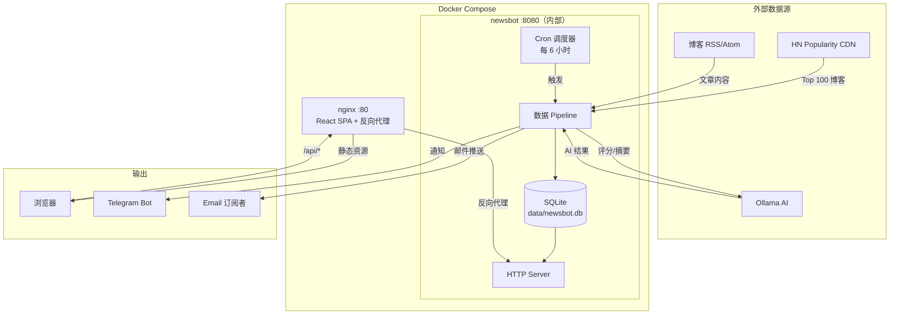
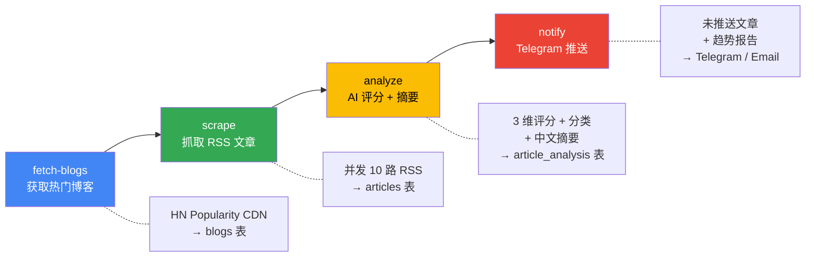
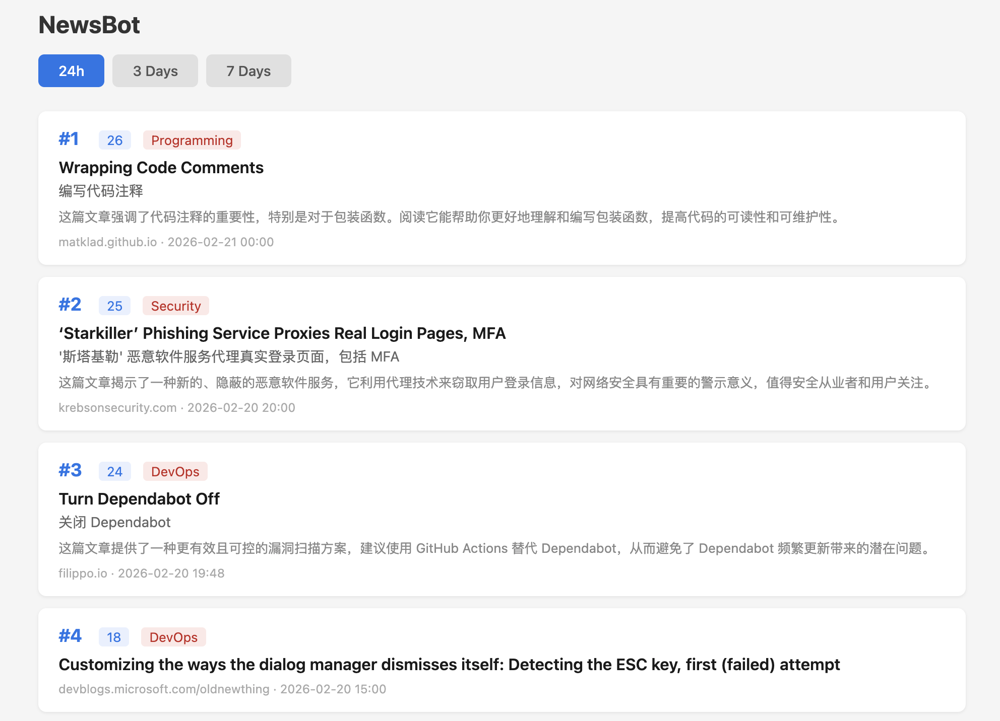
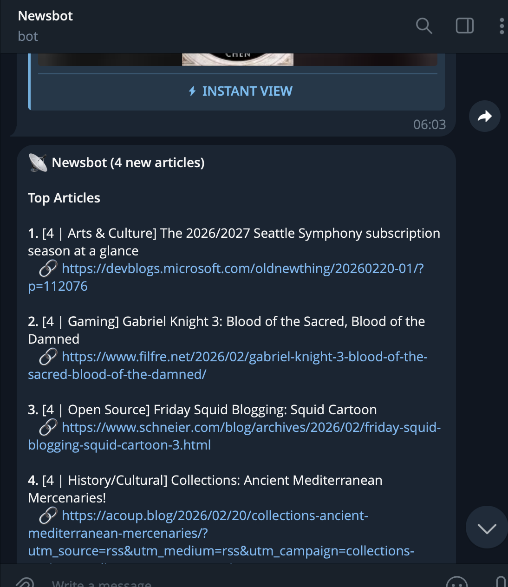
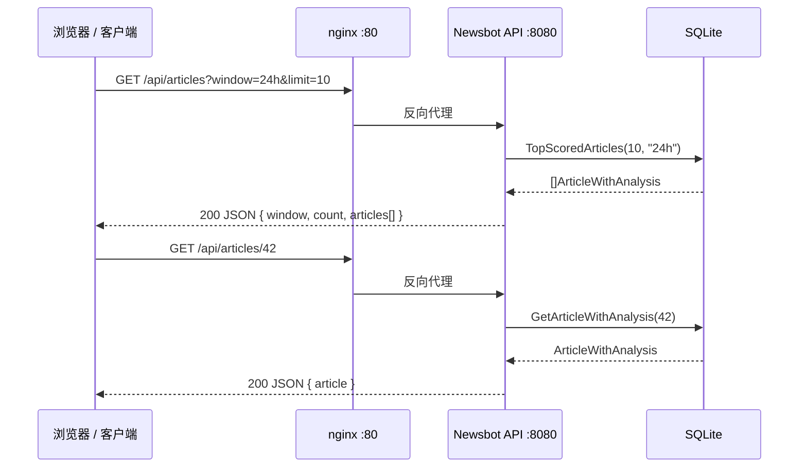

# Newsbot

Newsbot 是一个自动化技术新闻聚合与分析工具。它从 Hacker News 热门博客中抓取最新文章，利用 AI（Ollama）进行评分、分类、摘要和趋势分析，通过 Telegram Bot 推送每日技术速报，并支持邮件订阅（Gmail / SMTP）。前端采用 React SPA，后端提供纯 REST API，通过 nginx 反向代理统一对外暴露。

## 系统架构


```mermaid
graph TB
    subgraph External["外部数据源"]
        HN["HN Popularity CDN"]
        RSS["博客 RSS/Atom"]
        Ollama["Ollama AI"]
    end

    subgraph Deploy["Docker Compose"]
        Nginx["nginx :80<br/>React SPA + 反向代理"]
        subgraph Newsbot["newsbot :8080（内部）"]
            Scheduler["Cron 调度器<br/>每 6 小时"]
            Pipeline["数据 Pipeline"]
            HTTP["HTTP Server"]
            DB[("SQLite<br/>data/newsbot.db")]
        end
    end

    subgraph Output["输出"]
        Browser["浏览器"]
        TG["Telegram Bot"]
        Email["Email 订阅者"]
    end

    HN -->|Top 100 博客| Pipeline
    RSS -->|文章内容| Pipeline
    Pipeline -->|评分/摘要| Ollama
    Ollama -->|AI 结果| Pipeline
    Pipeline --> DB
    Scheduler -->|触发| Pipeline
    DB --> HTTP
    Browser -->|"/api/*"| Nginx
    Nginx -->|反向代理| HTTP
    Nginx -->|静态资源| Browser
    Pipeline -->|通知| TG
    Pipeline -->|邮件推送| Email
```

## 数据 Pipeline


```mermaid
graph LR
    A["fetch-blogs<br/>获取热门博客"] --> B["scrape<br/>抓取 RSS 文章"]
    B --> C["analyze<br/>AI 评分 + 摘要"]
    C --> D["notify<br/>Telegram 推送"]

    A -.- A1["HN Popularity CDN<br/>→ blogs 表"]
    B -.- B1["并发 10 路 RSS<br/>→ articles 表"]
    C -.- C1["3 维评分 + 分类<br/>+ 中文摘要<br/>→ article_analysis 表"]
    D -.- D1["未推送文章<br/>+ 趋势报告<br/>→ Telegram / Email"]

    style A fill:#4285f4,color:#fff
    style B fill:#34a853,color:#fff
    style C fill:#fbbc04,color:#000
    style D fill:#ea4335,color:#fff
```

1. **fetch-blogs** — 从 [HN Popularity](https://refactoringenglish.com/tools/hn-popularity/) CDN 获取 Top 100 热门博客
2. **scrape** — 并发抓取博客 RSS/Atom 订阅源（10 路并发，兼容 RSS 2.0 / Atom），每个博客最多 10 篇文章
3. **analyze** — AI 从相关性、质量、时效性三个维度打分（1-10），自动分类和关键词提取；为所有文章生成结构化摘要、中文标题翻译、推荐理由（失败自动重试 3 次）
4. **report** — 输出 Top 文章列表 + AI 归纳 2-3 个宏观技术趋势，自动推送 Telegram（如已配置）
5. **notify** — 自动筛选未推送的文章，生成趋势报告并发送 Telegram 通知
6. **email 订阅** — 用户在前端订阅邮箱后，每次 pipeline 完成自动发送 HTML 格式技术速报（含一键退订链接）

## 效果展示

### 文章浏览页面

> 访问 `http://localhost`，支持 24h / 3 Days / 7 Days 时间窗口切换



### Telegram 推送

> 配置 Bot Token 和 Chat ID 后，pipeline 完成自动推送技术速报



## 快速开始

### 前置条件

- Ollama 实例（或兼容 OpenAI API 的服务）
- （可选）Telegram Bot Token
- （可选）SMTP 服务，如 Gmail App Password
- Docker & Docker Compose（生产部署）

### 配置

创建 `newsbot.yaml`：

```yaml
ollama:
  address: "https://your-ollama-server.com"
  model: "gemma3:4b"
```

创建 `.env` 文件存放敏感信息：

```
OLLAMA_USERNAME=your_username
OLLAMA_PASSWORD=your_password
TG_BOT_TOKEN=123456:ABC-DEF...
TG_CHAT_ID=-100123456789

# Gmail SMTP（邮件订阅，可选）
SMTP_HOST=smtp.gmail.com
SMTP_PORT=587
SMTP_USERNAME=your-gmail@gmail.com
SMTP_PASSWORD=xxxx-xxxx-xxxx-xxxx
SMTP_FROM=NewsBot <your-gmail@gmail.com>
SITE_URL=https://your-site.com
```

环境变量（覆盖 YAML）：

| 变量 | 说明 |
|---|---|
| `OLLAMA_ADDRESS` | Ollama API 地址 |
| `OLLAMA_MODEL` | 模型名称（默认 `gemma3:4b`） |
| `OLLAMA_USERNAME` | Basic Auth 用户名 |
| `OLLAMA_PASSWORD` | Basic Auth 密码 |
| `TG_BOT_TOKEN` | Telegram Bot API Token |
| `TG_CHAT_ID` | Telegram 聊天/频道 ID |
| `SMTP_HOST` | SMTP 服务器地址（如 `smtp.gmail.com`） |
| `SMTP_PORT` | SMTP 端口（587 STARTTLS / 465 TLS） |
| `SMTP_USERNAME` | SMTP 用户名（Gmail 地址） |
| `SMTP_PASSWORD` | SMTP 密码（Gmail 需使用应用专用密码） |
| `SMTP_FROM` | 发件人地址（如 `NewsBot <you@gmail.com>`） |
| `SITE_URL` | 站点地址，用于邮件中的退订链接 |

`.env` 文件在启动时自动加载。

### Docker 部署（推荐）

直接使用 Docker Hub 预构建镜像，无需源码：

```sh
# 拉取最新镜像并启动
docker compose pull
docker compose up -d

# 停止
docker compose down

# 查看日志
docker compose logs -f
```

服务启动后访问 `http://localhost` 即可。

### 本地开发

**后端：**

```sh
# 前置条件：Go 1.24+
git clone https://github.com/chyiyaqing/newsbot.git
cd newsbot
make build

# 单步执行
go run . fetch-blogs            # 获取热门博客
go run . scrape                 # 抓取最新文章
go run . analyze 24h            # AI 分析（可选 3days / 7days）
go run . report 24h             # 生成报告 + 自动推送 Telegram
go run . notify 24h             # 推送未通知的文章到 Telegram

# 后台服务 — 立即执行 pipeline，然后 HTTP + cron 每 6 小时一次
go run . run
go run . run "0 */2 * * *"      # 自定义 cron 表达式
go run . run --addr=:9090       # 自定义 HTTP 监听地址
```

**前端（开发模式）：**

```sh
make fe-install   # 安装依赖
make fe-dev       # 启动 Vite 开发服务器（代理到本地后端 :8080）
```

### 构建与发布

```sh
# 后端
make build                  # 编译二进制
make docker                 # 构建 Docker 镜像
make docker-buildx          # 多平台构建并推送（linux/amd64,linux/arm64）

# 前端
make fe-build               # 构建生产静态文件
make fe-docker              # 构建前端 Docker 镜像
make fe-docker-buildx       # 多平台构建并推送

# 一键部署
make up                     # docker compose up -d --build
make down                   # docker compose down
make logs                   # docker compose logs -f
```

## REST API

后端提供纯 JSON API，默认监听 `:8080`，由 nginx 代理至 `/api/`。


```mermaid
sequenceDiagram
    participant Client as 浏览器 / 客户端
    participant Nginx as nginx :80
    participant API as Newsbot API :8080
    participant DB as SQLite

    Client->>Nginx: GET /api/articles?window=24h&limit=10
    Nginx->>API: 反向代理
    API->>DB: TopScoredArticles(10, "24h")
    DB-->>API: []ArticleWithAnalysis
    API-->>Client: 200 JSON { window, count, articles[] }

    Client->>Nginx: GET /api/articles/42
    Nginx->>API: 反向代理
    API->>DB: GetArticleWithAnalysis(42)
    DB-->>API: ArticleWithAnalysis
    API-->>Client: 200 JSON { article }
```

| 路径 | 说明 |
|---|---|
| `GET /health` | 健康检查 — `{"status":"ok"}` |
| `GET /api/articles?window=24h&limit=20` | 文章列表（JSON），按总分降序，同分按时间降序 |
| `GET /api/articles/{id}` | 单篇文章详情（JSON） |
| `POST /api/subscribe` | 邮件订阅 — body: `{"email":"user@example.com"}` |
| `GET /api/unsubscribe?token=xxx` | 一键退订（邮件中的退订链接） |

**查询参数：**
- `window` — 时间窗口：`24h`（默认）、`3days`、`7days`
- `limit` — 返回数量：1-100，默认 20

**响应示例：**

```sh
curl http://localhost/api/articles?window=24h&limit=5
```

```json
{
  "window": "24h",
  "count": 5,
  "articles": [
    {
      "id": 42,
      "title": "Side-Channel Attacks Against LLMs",
      "title_cn": "针对大型语言模型的侧信道攻击",
      "url": "https://example.com/article",
      "source": "krebsonsecurity.com",
      "summary": "...",
      "ai_summary": "...",
      "recommend_reason": "...",
      "category": "Security",
      "keywords": "LLM, side-channel, security",
      "total_score": 26,
      "relevance": 9,
      "quality": 9,
      "timeliness": 8,
      "published_at": "2026-02-20T20:00:00Z",
      "analyzed_at": "2026-02-21T01:30:00Z"
    }
  ]
}
```

## 项目结构

```
newsbot/
├── main.go                          # CLI 入口，子命令分发
├── Dockerfile                       # 后端多阶段构建
├── docker-compose.yaml              # 一键部署（使用 Docker Hub 镜像）
├── Makefile                         # 构建 / 运行 / Docker / Compose 目标
├── newsbot.yaml                     # 配置文件
├── nginx/
│   └── nginx.conf                   # nginx 反向代理 + SPA fallback
├── frontend/                        # React 18 + Vite SPA
│   ├── Dockerfile                   # 前端多阶段构建（node → nginx）
│   ├── src/
│   │   ├── App.jsx                  # 根组件，管理时间窗口和文章状态
│   │   ├── api.js                   # REST API 调用封装
│   │   ├── index.css                # 全局样式（CSS 变量）
│   │   └── components/
│   │       ├── Header.jsx           # 顶栏 + 时间窗口 Tab
│   │       ├── ArticleList.jsx      # 文章列表（含骨架屏）
│   │       ├── ArticleCard.jsx      # 文章卡片（评分条、分类、关键词）
│   │       ├── ArticleModal.jsx     # 文章详情模态框
│   │       └── Subscribe.jsx        # 邮件订阅表单
│   └── package.json
├── data/
│   └── newsbot.db                   # SQLite 数据库（WAL 模式，运行时生成）
├── docs/images/                     # 效果截图
└── internal/
    ├── config/                      # 配置加载（YAML + .env + 环境变量）
    ├── store/                       # SQLite 持久化（blogs / articles / article_analysis / subscribers）
    ├── hnpopular/                   # HN Popularity CDN 数据解析
    ├── scraper/                     # 并发 RSS/Atom 抓取
    ├── ai/                          # Ollama 客户端（评分 / 摘要 / 趋势分析）
    ├── server/                      # HTTP 服务（REST API + 订阅接口 + CORS）
    ├── notify/                      # 通知接口（Notifier）
    │   ├── telegram/                # Telegram Bot 实现（HTML 格式，自动分片）
    │   └── email/                   # SMTP 邮件客户端（Gmail / 587 STARTTLS / 465 TLS）
    └── scheduler/                   # Cron 调度器（完整 pipeline + Telegram + 邮件推送）
```

## 依赖

**后端：**

| 包 | 用途 |
|---|---|
| `modernc.org/sqlite` | 纯 Go SQLite（无 CGo） |
| `github.com/mmcdole/gofeed` | RSS/Atom 订阅源解析 |
| `github.com/robfig/cron/v3` | Cron 定时调度 |
| `gopkg.in/yaml.v3` | YAML 配置解析 |

**前端：**

| 包 | 用途 |
|---|---|
| `react` / `react-dom` | UI 框架（v18） |
| `vite` | 构建工具 + 开发服务器 |

## Telegram 通知

配置 `TG_BOT_TOKEN` 和 `TG_CHAT_ID` 后：

- `report` — 生成报告后自动推送已分析的文章
- `notify` — 自动筛选未推送的文章并发送通知（去重，不会重复推送）
- `run` — 调度器每次 pipeline 完成后自动推送

消息格式为 HTML，包含 Top 文章列表（评分、分类、中文标题、推荐理由、链接）和技术趋势总结。超过 4096 字符的消息会自动拆分为多条发送。

## 邮件订阅

用户在前端页面底部输入邮箱即可订阅，每次 pipeline 完成后自动收到 HTML 格式的技术速报，邮件底部附有一键退订链接。

**配置（Gmail 示例）：**

1. Google 账号开启两步验证
2. 生成应用专用密码：账号 → 安全性 → 两步验证 → 应用专用密码
3. 在 `.env` 中配置：

```
SMTP_HOST=smtp.gmail.com
SMTP_PORT=587
SMTP_USERNAME=your-gmail@gmail.com
SMTP_PASSWORD=xxxx-xxxx-xxxx-xxxx
SMTP_FROM=NewsBot <your-gmail@gmail.com>
SITE_URL=https://your-site.com
```

未配置 SMTP 时，订阅 API 仍可正常接收邮箱（存入数据库），只是不发送邮件。

## License

MIT
